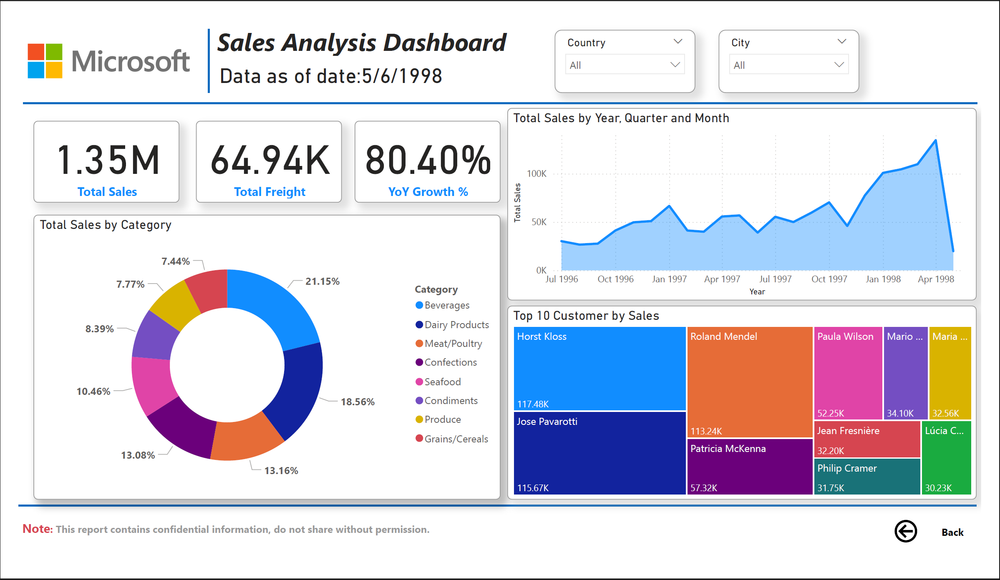

# Sales & Customer Analytics Dashboard



📊 **[View Dashboard PDF](./Sales-&-Customer-Analytics-Dashboard.pdf)** | 📁 **[Download .pbix File](./Sales-&-Customer-Analytics-Dashboard.pbix)**

## Project Overview
A Power BI sales and customer analytics dashboard developed as part of the **Edureka Business Analyst using Power BI certification** to demonstrate time intelligence, customer segmentation, and product performance analysis using the classic Northwind database.

**Dataset**: 2,155 order details | 830 orders | Multiple dimension tables  
**Scope**: $1.35M total sales | 8 product categories | Global customer base  
**Timeframe**: July 1996 - May 1998 (rapid growth period)

## Key Insights

### 📈 **Exceptional Growth Performance**
- **80.40% year-over-year growth** (validated through time intelligence DAX)
- **$1.35M total sales** across ~2-year period
- **$64.94K total freight costs** (4.8% of sales)
- Dramatic sales trajectory from $30K/month (mid-1996) to $130K+ peak (early 1998)

### 👥 **Customer Concentration**
- **Top customer: Horst Kloss** ($117.48K - 8.7% of total sales)
- **Top 3 customers represent 25.6% of revenue** (Horst Kloss, Jose Pavarotti, Roland Mendel)
- **High customer concentration risk** - significant dependence on few accounts
- **Strategic opportunity**: Diversify customer base to reduce revenue volatility

### 🥤 **Product Category Performance**
- **Beverages lead at 21.15%** of total sales ($286K)
- **Top 3 categories**: Beverages (21.15%), Dairy Products (18.56%), Meat/Poultry (13.16%)
- **Combined represent 52.87%** of revenue
- **Balanced portfolio** with 8 categories providing diversification

### 🌍 **Geographic Distribution**
- **Germany dominates** with $124K in sales
- **USA follows** at $121K
- **Austria strong performer** at $63K
- **Europe-heavy concentration** visible on global map
- Suggests potential for geographic expansion in underserved markets

### 📊 **Data Quality Observation**
- **Sudden drop-off in April-May 1998** (chart shows dramatic decline)
- Indicates dataset cutoff or data completeness issue
- In real scenario, would investigate data pipeline or business disruption

## Technical Implementation

### Data Architecture

**Data Model:**
- **Fact Tables**:
  - Orders (830 rows) - Order header information
  - Order Details (2,155 rows) - Line item details
- **Dimension Tables**:
  - Dim Date - Time intelligence support
  - Dim Categories - 8 product categories
  - Dim Customers - Customer master data
  - Dim Products - Product catalog

**Relationships:**
- Snowflake schema with multiple fact tables
- Date dimension supports time-based calculations
- Customer and product hierarchies for drill-down analysis

### DAX Measures - Time Intelligence
```dax
// Current Year Sales (Year-to-Date)
CY Sales = 
TOTALYTD(
    [Total Sales], 
    'Dim Date'[Date]
)

// Last Year Sales (Same Period)
LY Sales = 
CALCULATE(
    [CY Sales], 
    SAMEPERIODLASTYEAR('Dim Date'[Date])
)

// Sales Variance
Variance = [CY Sales] - [LY Sales]

// Year-over-Year Growth Percentage
YoY Growth % = 
DIVIDE(
    [Variance], 
    [LY Sales], 
    BLANK()
)

// Total Sales Base Measure
Total Sales = SUM('Order Details'[LineTotal])

// Total Freight Costs
Total Freight = SUM(Orders[Freight])
```

### Dashboard Features

#### **Page 1: Sales Summary**

**KPI Cards:**
- Total Sales ($1.35M)
- Total Freight ($64.94K)
- YoY Growth % (80.40%)

**Visualizations:**

1. **Total Sales by Category** (Donut Chart)
   - Clear percentage breakdown of 8 categories
   - Beverages (21.15%) leads the portfolio

2. **Total Sales by Year, Quarter and Month** (Area Chart)
   - Time series showing growth trajectory from 1996-1998
   - Reveals seasonal patterns and growth acceleration
   - Dramatic spike in early 1998 before data cutoff

3. **Top 10 Customer by Sales** (Bar Chart)
   - Customer concentration analysis
   - Horst Kloss significantly outperforms others
   - Long-tail distribution evident

**Interactive Filters:**
- Country slicer (multi-select)
- City slicer (cascading filter)

#### **Page 2: Customer Detail Matrix**

**Features:**
- Expandable customer hierarchy
- Sales breakdown by product category per customer
- Drill-down from country → customer → category
- Supports detailed customer profitability analysis

#### **Page 3: Q&A Interface**

**Natural Language Queries:**
- "top cities by total sales"
- "top ship countries by total freight"
- "top order sizes by total sales"
- Demonstrates Power BI Q&A functionality
- Enables ad-hoc analysis for business users

#### **Page 4: Drill-Through Analysis**

**Interactive Filters:**
- Year, Country, City, Contact Name, Category, Product cascading filters
- Drill-through from summary to transaction detail
- Supports root cause analysis and detailed investigation

#### **Page 5: Geographic Map**

**Global Sales Visualization:**
- Bubble map showing sales concentration by country
- Bubble size represents sales volume
- Clear visualization of European market dominance
- Identifies expansion opportunities

#### **Page 6: Trend Toggle**

**Sales vs. Freight Analysis:**
- Button toggle between Total Sales and Total Freight views
- Time series comparison
- Freight cost optimization insights

## Technical Skills Demonstrated

### ✅ **Time Intelligence**
- TOTALYTD for year-to-date calculations
- SAMEPERIODLASTYEAR for period comparisons
- Year-over-year growth analysis
- Period-based variance calculations

### ✅ **Customer Analytics**
- Customer concentration analysis
- Top customer identification and ranking
- Customer profitability segmentation
- Geographic customer distribution

### ✅ **Interactive Features**
- Cascading filter implementation (Country → City)
- Drill-through page configuration
- Button-based view toggling
- Q&A natural language interface

### ✅ **Visual Design**
- Multi-page dashboard structure
- Hierarchical data exploration
- Matrix visualizations with drill-down
- Professional Microsoft-branded layout

### ✅ **Business Intelligence**
- Growth trend analysis and forecasting implications
- Customer concentration risk identification
- Geographic expansion opportunity assessment
- Category performance benchmarking

## Tools & Technologies

- **Power BI Desktop**: Dashboard development and modeling
- **DAX**: Time intelligence and analytical measures
- **Power Query**: Data transformation and relationship management
- **Q&A Feature**: Natural language query implementation
- **Data Source**: Northwind database (Microsoft sample dataset via Edureka)

## Project Files
```
Sales-&-Customer-Analytics/
├── Sales-&-Analytics-Dashboard.pbix    # Power BI dashboard file
├── Sales-&-Analytics-Dashboard.pdf     # Multi-page dashboard export
├── Sales-&-Analytics-Dashboard.png     # Dashboard preview
└── README.md                           # This documentation
```

## How to Use This Dashboard

### **View the PDF**
- `Sales-&-Analytics-Dashboard.pdf` provides static 6-page overview

### **Interactive Exploration**
1. Download `Sales-&-Analytics-Dashboard.pbix`
2. Open in Power BI Desktop
3. Navigate through 6 pages:
   - **Page 1**: Sales summary with KPIs and trends
   - **Page 2**: Customer detail matrix
   - **Page 3**: Q&A natural language interface
   - **Page 4**: Drill-through analysis with cascading filters
   - **Page 5**: Geographic sales map
   - **Page 6**: Sales vs. freight trend comparison
4. Use slicers to filter by Country and City
5. Click "Back" buttons to return to summary views

## Business Applications

This dashboard framework supports:

**Customer Relationship Management:**
- Top customer identification and retention focus
- Customer concentration risk monitoring
- Geographic customer expansion planning
- Account-based revenue diversification

**Sales Performance Analysis:**
- Growth trajectory tracking (80% YoY)
- Category mix optimization
- Freight cost management
- Regional performance benchmarking

**Strategic Planning:**
- Market expansion prioritization
- Product portfolio balance assessment
- Customer acquisition targeting
- Revenue diversification strategies

## Learning Outcomes

This project demonstrates:

**Technical Competencies:**
- Advanced time intelligence with TOTALYTD and SAMEPERIODLASTYEAR
- Multi-page dashboard architecture
- Cascading filter implementation
- Natural language Q&A configuration
- Drill-through page design

**Analytical Competencies:**
- Customer concentration risk analysis
- Year-over-year growth calculation and interpretation
- Category performance benchmarking
- Geographic expansion opportunity identification

## Context & Authenticity

Created as part of the **Edureka Business Analyst using Power BI certification program** using the **Northwind database** - Microsoft's classic sample dataset representing a specialty foods import/export company. The data spans 1996-1998 and is widely used for training and education in database and BI tools.

The technical implementation, time intelligence methodology, and customer analytics approach are directly applicable to real-world sales analysis and customer segmentation scenarios.

## Frequently Asked Questions

**Q: What is the Northwind database?**  
A: Northwind is Microsoft's classic sample database depicting a specialty foods import/export company. It's been used since the 1990s for training and demonstrating database concepts. The data structure and business scenario are realistic, though the data itself is fictional.

**Q: Why is the YoY growth so high at 80%?**  
A: The Northwind dataset intentionally shows a rapidly growing company in its expansion phase (1996-1998). This high growth rate is realistic for a business in early-stage scaling. It provides a good scenario for demonstrating time intelligence and growth analysis techniques.

**Q: What's the key business insight from this analysis?**  
A: The main finding is customer concentration risk: Horst Kloss alone represents 8.7% of revenue, and the top 3 customers account for over 25%. While this shows strong relationships, it creates vulnerability if any key account is lost. The business should prioritize diversifying the customer base while maintaining these critical relationships.

**Q: What does the sudden drop-off in mid-1998 indicate?**  
A: This is a data completeness issue - the dataset ends in May 1998. In a real business scenario, I'd investigate whether this represents a data pipeline issue, system migration, or actual business disruption. The chart's dramatic decline is an artifact of the dataset boundary, not a real business trend.

**Q: How would you enhance this dashboard?**  
A: I'd add: (1) Customer lifetime value (CLV) analysis, (2) Product affinity/basket analysis to identify cross-sell opportunities, (3) Freight cost as percentage of sales by region to optimize logistics, (4) Forecasting models for sales prediction, (5) Customer cohort analysis showing retention rates, and (6) Profitability analysis at customer and product levels.

**Q: What's the difference between this and your other sales dashboard?**  
A: The Global Sales Performance Dashboard ($62.3M) focuses on multi-market profit optimization and row-level security with regional roles. This Customer Analytics Dashboard emphasizes time intelligence, customer segmentation, and natural language Q&A. They demonstrate different Power BI capabilities and analytical approaches.

---

## Author

**Mohit Pammu, MBA**  
Data Analyst | SQL, Python, Power BI  

📧 mopammu@gmail.com  
💼 [LinkedIn](https://linkedin.com/in/mohitpammu)  
🌐 [Portfolio](https://mohitpammu.github.io/Projects/)

**Certification**: Edureka Business Analyst using Power BI (January 2024)

---

*This project demonstrates Power BI time intelligence, customer analytics, and interactive dashboard design capabilities developed through professional certification coursework using Microsoft's Northwind sample database.*
