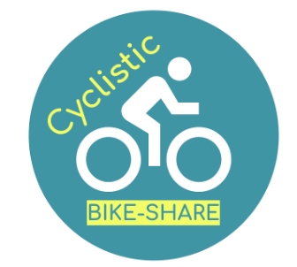

# Cyclistic Bike-Share Analysis

## Project Overview
This project analyzes Cyclistic bike-share usage data to understand the differences between casual riders and annual members. The analysis follows the Google Data Analytics Process: Ask, Prepare, Process, Analyze, Share, and Act.

## Business Problem
Cyclistic's finance analysts have determined that annual members are much more profitable than casual riders. The marketing director believes maximizing the number of annual members will be key to future growth. The marketing analytics team needs to understand:
- How annual members and casual riders use Cyclistic bikes differently
- Why casual riders would buy a membership
- How digital media could influence casual riders to become members

## Data Source
The analysis uses Divvy's trip data from January through December 2023, made available under the [Data License Agreement](https://divvybikes.com/data-license-agreement).

## Tools Used
- R for data cleaning, transformation, analysis, and visualization
- R packages:
  - tidyverse (for data manipulation and visualization)
  - readxl (for importing Excel files)
  - conflicted (for managing package conflicts)

## Analysis Process
1. **Ask**: Defined the business task and identified key stakeholders
2. **Prepare**: Collected and organized 12 months of Cyclistic trip data
3. **Process**: Cleaned and transformed the data, including:
   - Converting data types for consistency
   - Combining monthly datasets
   - Removing irrelevant columns and NA values
   - Adding date/time fields for aggregation
   - Calculating ride lengths
4. **Analyze**: Performed descriptive analysis to identify patterns and relationships
5. **Share**: Created visualizations to communicate findings, including:
   - Number of rides by day of week and rider type
   - Average ride duration by day of week and rider type
   - Number of rides by month and rider type
   - Bike type preferences by rider type
6. **Act**: Provided recommendations based on analysis findings

## Key Findings
- Casual riders' average trip duration (22.49 minutes) is approximately 1.84x longer than members (12.23 minutes)
- Members have a higher frequency of use at about 1.83x compared to casual users
- Members account for approximately 64.64% of total usage
- Casual users show heavier usage on weekends (Fri-Sun) while members use bikes more during weekdays (Mon-Fri)
- Both user types show highest usage from May through October, with lowest usage in winter months

## Recommendations
Based on the analysis, several strategies were recommended:
1. **Member Exclusive Benefits**: Provide discounts to popular destinations for members
2. **Usage Time Promotion**: Reward longer rides with points toward membership
3. **Membership Rank**: Create a tiered system with status levels to foster community
4. **Seasonal/Weekend Memberships**: Offer flexible membership options tailored to casual user patterns
5. **Bike Type Promotions**: Create special offers for specific bike types on lower-usage days

## Getting Started
1. Clone this repository
2. Install the required R packages (see requirements.txt)
3. Open the R project file (DA-Capstone-Cyclystic.Rproj)
4. Run the analysis in the R Notebook or review the HTML output

## Author
Mohit Pammu, MBA
